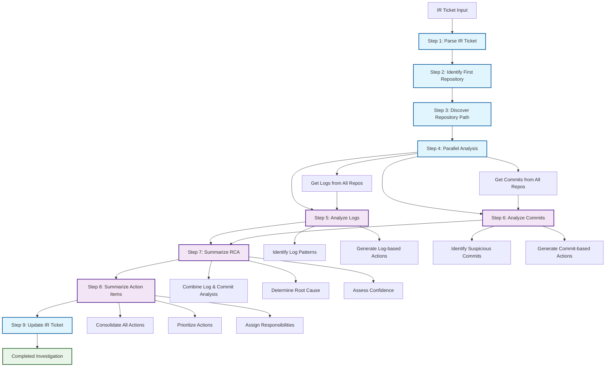
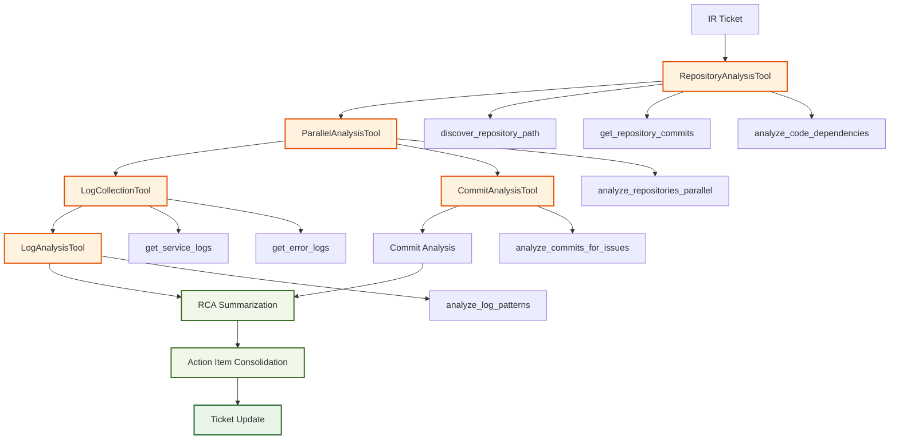

# Incident Response Agent Workflow

## Overview

This document describes the 9-step incident response workflow implemented in the LangGraph Studio agent. The agent automatically handles IR tickets by following a systematic approach to identify root causes and generate action items.

## Workflow Steps

### Step 1: Parse IR Ticket
- **Input**: IR ticket with error information
- **Process**: Extract key information (incident ID, title, description, severity, affected components)
- **Output**: Structured incident data

### Step 2: Identify First Repository
- **Input**: Error description and incident details
- **Process**: Determine which repository to check first based on error type
- **Output**: First repository to investigate

### Step 3: Discover Repository Path
- **Input**: First repository and error context
- **Process**: Follow code dependencies to discover UI → GraphQL → Backend path
- **Output**: Complete repository path and all involved repositories

### Step 4: Parallel Analysis
- **Input**: List of all repositories
- **Process**: Simultaneously collect logs and git commits from all repositories
- **Output**: Repository commits and logs for all services

### Step 5: Analyze Logs
- **Input**: Log data from all repositories
- **Process**: Identify patterns, errors, and generate log-based action items
- **Output**: Log analysis with patterns and action items

### Step 6: Analyze Commits
- **Input**: Commit data from all repositories
- **Process**: Identify suspicious commits and generate commit-based action items
- **Output**: Commit analysis with potential issues and action items

### Step 7: Summarize Root Cause Analysis
- **Input**: Log analysis and commit analysis
- **Process**: Combine findings to determine root cause
- **Output**: Comprehensive RCA with evidence and confidence

### Step 8: Summarize Action Items
- **Input**: Log-based actions, commit-based actions, and RCA
- **Process**: Consolidate all action items into comprehensive plan
- **Output**: Prioritized action items with assignments and effort estimates

### Step 9: Update IR Ticket
- **Input**: RCA and action items
- **Process**: Update the original IR ticket with investigation results
- **Output**: Updated IR ticket with complete investigation

## Mermaid Diagram



## Detailed Workflow with Tools



## Example Scenario

### Input IR Ticket
```json
{
  "incident_id": "IR-2024-001",
  "title": "Products page not loading - UI error",
  "description": "Users cannot access the Products page. UI shows error message 'Could not connect to GraphQL service'. API calls are failing with timeout errors.",
  "severity": "HIGH",
  "affected_components": ["UI", "GraphQL", "Backend"],
  "user_impact": "Users cannot view or purchase products"
}
```

### Expected Workflow Execution

1. **Step 1**: Parse ticket → Extract UI error and GraphQL connection issues
2. **Step 2**: Identify first repo → Start with `frontend-ui` (UI error)
3. **Step 3**: Discover path → `frontend-ui` → `graphql-service` → `backend-service`
4. **Step 4**: Parallel analysis → Get logs and commits from all 3 repos simultaneously
5. **Step 5**: Analyze logs → Find memory errors in GraphQL service
6. **Step 6**: Analyze commits → Find recent config changes in backend-service
7. **Step 7**: RCA → Backend config change caused GraphQL OOM
8. **Step 8**: Actions → Rollback config, increase memory limits, add monitoring
9. **Step 9**: Update ticket → Complete investigation with RCA and action plan

### Expected Output
```json
{
  "root_cause_analysis": {
    "root_cause": "Backend service configuration change caused memory pressure leading to GraphQL service OOM",
    "contributing_factors": ["Recent config deployment", "Insufficient memory limits", "Lack of monitoring"],
    "confidence": 0.95,
    "evidence": ["Memory errors in logs", "Recent config commit", "Service dependency chain"]
  },
  "action_items": [
    {
      "action": "Rollback recent backend configuration changes",
      "priority": "high",
      "category": "immediate",
      "assignee": "DevOps Team",
      "estimated_effort": "30 minutes"
    },
    {
      "action": "Increase GraphQL service memory limits",
      "priority": "high", 
      "category": "immediate",
      "assignee": "Platform Team",
      "estimated_effort": "15 minutes"
    },
    {
      "action": "Add memory monitoring and alerting",
      "priority": "medium",
      "category": "short_term", 
      "assignee": "SRE Team",
      "estimated_effort": "2 hours"
    }
  ]
}
```

## Key Features

### 🔍 **Automatic Repository Discovery**
- Follows code dependencies to discover service relationships
- No hardcoded paths - dynamically discovers based on error context

### ⚡ **Parallel Analysis**
- Simultaneously analyzes multiple repositories
- Reduces investigation time significantly

### 🎯 **Intelligent Pattern Recognition**
- Identifies suspicious commits and log patterns
- Correlates findings across multiple services

### 📋 **Comprehensive Action Planning**
- Consolidates findings into actionable items
- Prioritizes actions based on impact and effort

### 🔄 **Complete Ticket Lifecycle**
- Updates original IR ticket with investigation results
- Provides audit trail of investigation process

## Tools Used

1. **RepositoryAnalysisTool**: Discovers repository paths and dependencies
2. **LogCollectionTool**: Collects logs from services
3. **CommitAnalysisTool**: Analyzes git commits for issues
4. **LogAnalysisTool**: Identifies patterns in logs
5. **ParallelAnalysisTool**: Coordinates parallel analysis

## Benefits

- **Faster Resolution**: Automated analysis reduces manual investigation time
- **Consistent Process**: Standardized 9-step workflow ensures thorough investigation
- **Comprehensive Coverage**: Analyzes both logs and code changes
- **Actionable Results**: Provides specific, prioritized action items
- **Audit Trail**: Complete documentation of investigation process
